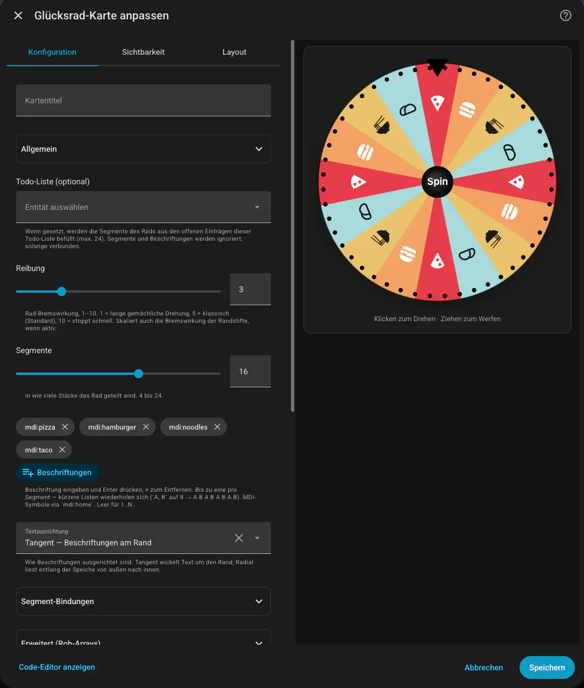

# Spinning Wheel Card

[](https://github.com/hacs/integration)
[](https://github.com/rolandzeiner/spinning-wheel-card/releases)
[](https://opensource.org/licenses/MIT)
[](https://en.wikipedia.org/wiki/Vibe_coding)

A click-to-spin / drag-to-flick wheel for Home Assistant Lovelace. Realistic angular-momentum physics (drag to throw, friction decay), 4–24 segments, optional per-segment Lovelace actions, todo-list integration. Pure frontend — no Python required.

## Features

- **Click-to-spin / drag-to-throw** with frame-rate-independent friction (`low` / `medium` / `high`).
- **Half-circle mode** — render as a dome (pointer top, hub on the cut line). Compact for narrow cells.
- **Selector mode** — no spin, no momentum. Drag to align a segment with the indicator and release to fire its action; hub text hides since the centre prompt no longer applies.
- **Rim pegs** — opt-in real-prize-wheel feel: visible pegs at the rim, each one fires a click sound and a tiny brake bump as it passes the indicator. Optional `peg_density` slider (0–4) for how many extra pegs sit inside each segment. Smooth ease-out settle nudges the wheel off any peg it stops on; borderline stops occasionally back-roll against the peg ("the peg almost blocked it").
- **Per-segment** labels, weights, colours, label colours, Lovelace actions. Lists shorter than `segments` cycle; same-label segments share fill / label colour / action.
- **MDI icons as labels** — type `mdi:home` and the icon paints in place of text. The result line shows the icon glyph too, not the literal `mdi:` identifier.
- **Result helper** — write the winning label into an `input_text.*` so HA automations trigger on `platform: state`.
- **Wheel context** — opt-in: every fired action gets the winning segment merged into its `data` payload (`wheel_index`, `wheel_label`, `wheel_color`, `wheel_color_rgb`, `wheel_label_color`, `wheel_label_color_rgb`). One generic script can then handle every segment.
- **Todo-list integration** — point at a `todo.*` entity; segments fill from its open items.
- **Two label orientations** — *tangent* (around the rim) or *radial* (along the spoke).
- **Segment borders** — thin white separator stroke between slices; toggle off for a flatter, edge-to-edge look.
- **Theme-aware** indicator + hub; auto-contrast hub label via WCAG luminance.
- **Synthesised peg-click sound** (Web Audio, no asset). Toggle off in config.
- **Responsive canvas** — 140–600 px, scales to the dashboard cell on both axes.
- **Visual editor** with grouped sections (General / Segment bindings / Advanced).
- **8 bundled languages** — `en` / `de` / `fr` / `it` / `es` / `pt` / `zh` / `ja`; falls back to English.
- **WCAG 2.2 A+AA** — keyboard activation, focus-visible ring, `prefers-reduced-motion`, forced-colors fallback.

## Screenshots

<table>
  <tr>
    <td align="center"></td>
  </tr>
  <tr>
    <td align="center"><em>Visual editor — every option in one form</em></td>
  </tr>
</table>

## Installation

### HACS (recommended)

[](https://my.home-assistant.io/redirect/hacs_repository/?owner=rolandzeiner&repository=spinning-wheel-card&category=plugin)

HACS → **Frontend** → ⋯ → **Custom repositories** → add `https://github.com/rolandzeiner/spinning-wheel-card` as type **Lovelace** → install → hard-refresh (⌘⇧R).

### Manual

Download `spinning-wheel-card.js` from the [latest release](https://github.com/rolandzeiner/spinning-wheel-card/releases), copy to `<config>/www/community/spinning-wheel-card/`, and add a Lovelace resource at `/local/community/spinning-wheel-card/spinning-wheel-card.js` (type **JavaScript module**).

## Quick start

```yaml
type: custom:spinning-wheel-card
```

8 numeric segments, medium friction, sound on, tangent labels, language auto-detected.

## Configuration

All options optional. Use the visual editor (Add Card → Spinning Wheel Card → ⚙) or YAML.

| Option | Type | Default | Description |
| --- | --- | --- | --- |
| `name` | string | unset | Card header text. Empty / unset hides the header. |
| `language` | ISO-639-1 string | auto | Override the auto-detected display language. Unsupported codes fall back to English. |
| `segments` | integer 4–24 | `8` | Slice count. Ignored when `todo_entity` is set. |
| `friction` | `low` / `medium` / `high` | `medium` | See [Friction presets](#friction-presets). |
| `theme` | `default` / `pastel` / `pride` / `neon` | `default` | Built-in palette when `colors` is empty. See [Theme presets](#theme-presets). |
| `labels` | string[] | `1`…`N` | Per-segment labels. Shorter lists cycle. MDI icons via `mdi:icon-name`. Ignored when `todo_entity` is set. |
| `weights` | number[] | all equal | Relative segment widths (only the ratio matters). Cycles. |
| `colors` | string[] | active `theme` | CSS colours (hex / rgb / hsl / `var(--…)` / named). Mapped to **unique labels in first-appearance order**. Overrides `theme`. |
| `label_colors` | string[] | dark grey | Label text colours. Same unique-label mapping as `colors`. |
| `actions` | array of `string` / `ActionConfig` / `null` | none | Action fired on win. `script.foo` shortcuts to `perform-action`; full Lovelace [`ActionConfig`](https://www.home-assistant.io/dashboards/actions/) objects supported. Same unique-label mapping. |
| `disable_confirm_actions` | boolean | `false` | Skip the "Run … for X?" prompt. Per-action `confirmation: false` opts a single one out. |
| `wheel_context` | boolean | `false` | Merge the winning segment into every `perform-action` / `call-service` payload as `wheel_index` / `wheel_label` / `wheel_color` / `wheel_color_rgb` / `wheel_label_color` / `wheel_label_color_rgb`. User-supplied `data` keys win on collision. See [Wheel-context example](#wheel-context-pick-a-colour-set-a-light). |
| `disable_boost` | boolean | `false` | Ignore clicks (and `Space`/`Enter`) while the wheel is spinning. Drag-to-throw unaffected. |
| `half_circle` | boolean | `false` | Dome layout — only the upper half renders, hub on the cut line, card height shrinks. Spinning physics unchanged. |
| `selector_mode` | boolean | `false` | Manual picker — no spin, no momentum, hub text hidden. Drag to align a segment, release to commit. |
| `segment_borders` | boolean | `true` | Thin white separator stroke between adjacent slices. Set `false` for a flatter, edge-to-edge look (e.g. with bold neon / pride palettes). |
| `pegs` | boolean | `false` | Render small pegs at the rim. Each peg fires a peg-click sound (gated by `sound`) and a small velocity bump as it passes the indicator. The wheel smoothly settles off any peg it stops on; borderline stops have a chance to back-roll against the peg. |
| `peg_density` | integer 0–4 | `1` | Extra pegs per segment beyond the always-present boundary peg. `0` = boundary pegs only (`segments` total); `1` = boundary + 1 mid (`2 × segments`, default); `4` = densely studded (`5 × segments`). Ignored when `pegs: false`. |
| `result_entity` | `input_text.*` entity_id | none | Helper to receive the winning label after every spin. Editor's "Create dedicated helper" button auto-provisions one (admin only). |
| `todo_entity` | `todo.*` entity_id | none | Fill segments from this entity's open items (4–24, deduped). `segments`, `labels`, `text_orientation` are ignored while wired. |
| `text_orientation` | `tangent` / `radial` | `tangent` (`radial` in todo mode) | Tangent wraps text around the rim; radial reads along the spoke. |
| `hub_text` | string | localised (`SPIN` / `DREH` / …) | Centre-hub label. Auto-shrinks. Empty hides. |
| `hub_color` | `theme` / `black` / `white` | `theme` | Hub + indicator fill. `theme` uses HA's `--primary-color` with auto-contrast text. |
| `sound` | boolean | `true` | Peg-click sound on segment crossings. |
| `show_status` | boolean | `true` | Show the line beneath the wheel (`Spinning…` / `Result: X` / idle hint). |

### Friction presets

| Preset | @ 60 fps | Stops after |
| --- | --- | --- |
| `low` | 0.995 | ~6 s |
| `medium` | 0.99 | ~4 s |
| `high` | 0.98 | ~2 s |

Decay is frame-rate independent — `ω *= friction^(60·dt)`.

### Theme presets

| Preset | Palette |
| --- | --- |
| `default` | 8-colour rainbow. |
| `pastel` | 8 soft, low-saturation tones. |
| `pride` | 10-colour inclusive Pride: 6-stripe rainbow + Helms transgender stripes + bisexual purple. Cycles for `segments > 10`. |
| `neon` | 8 vivid, fully-saturated tones. Pair with `label_colors: ["#ffffff"]`. |

A custom `colors` array always overrides `theme`.

## Examples

**Yes / No wheel** — labels cycle:

```yaml
type: custom:spinning-wheel-card
labels: [Yes, No]
colors: ["#06d6a0", "#e63946"]
hub_text: GO
```

**Weighted wheel** — one big slice, three small:

```yaml
type: custom:spinning-wheel-card
segments: 4
weights: [2, 1, 1, 1]
labels: [Jackpot, Try Again, Try Again, Try Again]
```

**Icon wheel** — labels are MDI icons:

```yaml
type: custom:spinning-wheel-card
segments: 6
labels: [mdi:pizza, mdi:hamburger, mdi:noodles, mdi:taco, mdi:food-croissant, mdi:silverware-fork-knife]
hub_text: ""
```

**Per-segment actions** — fire a script per winner:

```yaml
type: custom:spinning-wheel-card
labels: [Pizza, Burgers, Sushi]
actions: [script.order_pizza, script.order_burgers, script.order_sushi]
```

**Result helper** — push the winning label into an `input_text` so automations can trigger:

```yaml
type: custom:spinning-wheel-card
labels: [Bedtime, Movie, Game night]
result_entity: input_text.spinning_wheel_result
```

```yaml
- alias: Wheel result router
  trigger:
    - platform: state
      entity_id: input_text.spinning_wheel_result
  action:
    - service: scene.turn_on
      target:
        entity_id: "scene.{{ trigger.to_state.state | lower | replace(' ', '_') }}"
```

**Todo-list wheel** — segments from open items:

```yaml
type: custom:spinning-wheel-card
todo_entity: todo.shopping_list
hub_text: ""
```

**Half-circle dial** — compact dome layout:

```yaml
type: custom:spinning-wheel-card
half_circle: true
labels: [Easy, Medium, Hard]
```

**Selector mode** — manual picker, no spinning:

```yaml
type: custom:spinning-wheel-card
selector_mode: true
labels: [Living room, Kitchen, Bedroom]
actions: [script.lights_living, script.lights_kitchen, script.lights_bedroom]
```

**Wheel context — one script, every segment:**

`wheel_context: true` merges the winning segment into the action's `data`. One script handles every segment.

```yaml
type: custom:spinning-wheel-card
labels: [Red, Green, Blue]
colors: ["#e40303", "#008026", "#004dff"]
wheel_context: true
actions:
  - perform_action: script.set_light_colour
  - perform_action: script.set_light_colour
  - perform_action: script.set_light_colour
```

```yaml
# script.set_light_colour
sequence:
  - action: light.turn_on
    target:
      entity_id: light.living_room
    data:
      rgb_color: "{{ wheel_color_rgb }}"
```

**Real-prize-wheel** — densely studded rim, click + brake on every peg:

```yaml
type: custom:spinning-wheel-card
pegs: true
peg_density: 3       # 4 pegs per segment (1 boundary + 3 mids)
segment_borders: false
theme: pride
labels: [mdi:pizza, mdi:hamburger, mdi:noodles, mdi:taco, mdi:food-croissant, mdi:silverware-fork-knife]
```

**Kid-safe wheel** — disable boost + skip confirmation:

```yaml
type: custom:spinning-wheel-card
disable_boost: true
disable_confirm_actions: true
labels: [Brush teeth, Read a book, Pyjamas]
actions: [script.bathroom_routine, script.bedside_lamp_on, script.warmer_lights]
```

## Controls

| Action | Behaviour |
| --- | --- |
| Click at rest | Random impulse spin (random direction). |
| Click while spinning | **Boost** — adds an impulse in the current direction. |
| Click + drag (>3 px) | Wheel follows cursor; release flicks at the sampled angular velocity. |
| `Space` / `Enter` (focused) | Keyboard equivalent of click. In selector mode: re-fires the current selection (after a prior drag). |

## Translations

Active language follows `hass.locale.language` → `hass.language` → `navigator.language` → `en`. BCP-47 region codes (`en-GB`, `de-AT`, …) normalise to the ISO-639-1 base. Switching language in HA re-renders live. Override per-card via `language` (or "Auto" in the editor).

Adding a language: drop a `<code>.json` next to `src/localize/languages/*.json`, register it in `src/localize/localize.ts`, `npm run build`. Missing keys fall through to English.

## Accessibility

- **Keyboard**: `Tab` to focus, `Space` / `Enter` to spin (or commit in selector mode). `:focus-visible` ring.
- **Reduced motion**: `prefers-reduced-motion: reduce` skips the decay animation; the wheel snaps directly to the result. WCAG 2.3.3.
- **Hub text**: auto-picks black or white via WCAG relative luminance against `--primary-color`.
- **Forced colors** (Windows High Contrast): focus ring uses `CanvasText`.

## Browser support

Chrome / Edge / Firefox / Safari current major + previous. Uses Web Audio, ResizeObserver, Pointer Events, ES2022.

## Build from source

```bash
npm install
npm run build       # → dist/spinning-wheel-card.js
npm run dev         # rollup watch mode
```

See [CONTRIBUTING.md](CONTRIBUTING.md).

## License

[MIT](LICENSE) © Roland Zeiner.
